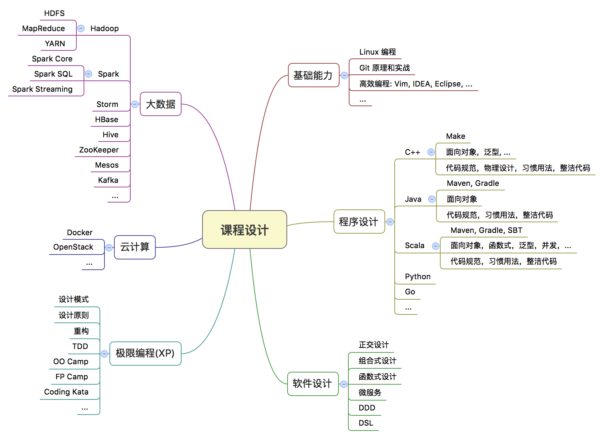

## 使命

> 软件改变世界，软件改变人生。

## 理想

* 聚焦在校大学生基础教育，提升毕业生的竞争优势；
* 承接企业技术培训，及其技术咨询；
* 承接企业软件外包服务；

## 关注领域

- 大数据
- 云计算
- 移动互联网

## 总体设计

## 贡献社区

我们是「西安匠艺社区」的发起人，曾多次组织了Spark, Mesos, Docker等技术Meetup；我们坚持每个月举办一次Coding Kata，激发程序员对软件设计永无止境的追求。

## 关于我们

我们的讲师团均来自于国内外顶尖的IT公司，包括阿里，腾讯，IBM，ThoughtWorks，华为，中兴等，他们拥有敏锐的行业技术发展的洞察力，及其丰富的大规模系统软件的开发经验。

我们致力于优秀的软件开发过程，积极关注当前炙手可热的技术；并且，我们与国内各大企业建立了长期的战略合作协议，积极搭建学生与企业之间的桥梁，为企业输送最优秀的技术人才。

