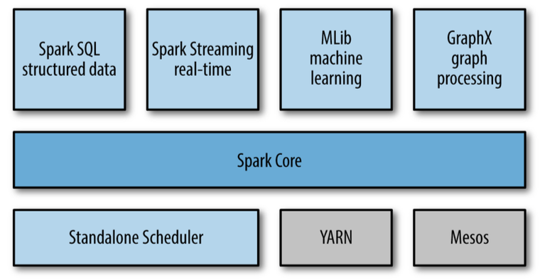
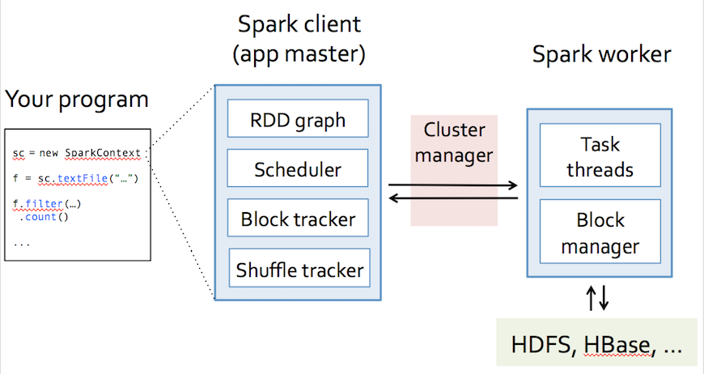
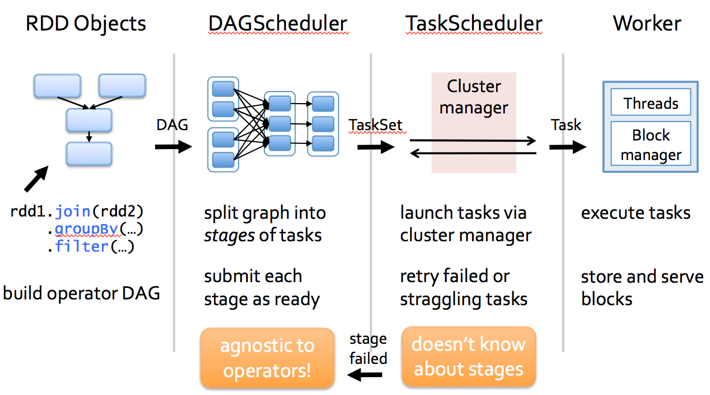
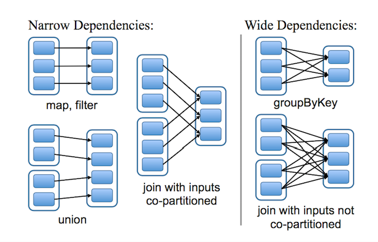
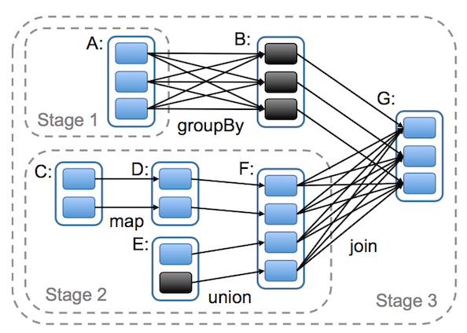

# Programming Spark

## What's Spark

**Apache Spark™** is a fast and general engine for large-scale data processing.

- Author：Matei Zaharia, AMPLab, UC Berkeley
- [http://spark.apache.org](http://spark.apache.org)

### Spark技术栈



### Spark优势

#### 高性能

> Run programs up to 100x faster than Hadoop MapReduce in memory, or 10x faster on disk.

`Spark`的性能归诸于以下原因：

- 基于内存的迭代式计算
- 基于`DAG`的执行引擎
- 基于`RDD`的统一抽象模型
- 出色的自动容错机制

#### 易学易用

- 多语言(`Sacla, Java, Python, R`)
- 函数式

以`Word Count`为例，使用`RDD`算子的组合可方便地完成各种计算。

```scala
sc.textFile("hdfs://...")
  .flatMap(_.split(" "))
  .map((_, 1))
  .reduceByKey(_+_)
```

#### 通用

`One Stack to rule them all`构建统一的技术栈

- `Spark SQL`
- `Spark Streaming` 
- `Spark MLlib`
- `Spark GraphX`

近乎完美解决了大数据中三大应用场景。

- `Batch Processing`
- `Streaming Processing`
- `Ad-hoc Query`

#### 易集成，易部署

支持多种部署方式：

- `Standalone`
- `Yarn`
- `Mesos` 
- `EC2`

支持多种外部数据源：

- `HDFS` 
- `HBase`
- `Hive` 
- `Cassandra`
- `S3`

## Scheduler

### Spark组件

`Driver Program`是`Spark`的核心内容，其主要包括三个组件：

- `RDD`
- `DAGScheduler`
- `TaskSheduler`




### 部署方式

- `Standalne`
- `Yarn`
- `Mesos`
- `Cloud`


### 调度器

- 根据`RDD`的依赖关系，由`DAGScheduler`完成`Stage`的划分；
- `DAGScheduler`依次将`Stage(TaskSet)`提交至`TaskScheduler`执行；
- `TaskScheduler`选择合适的`Worker`，将`Task`提交至`Executor`上计算；
- `Executor`从线程池中分配一个空闲的线程执行此`Task`。



## Essential RDD

`RDD(Resilient Distributed Dataset)`，是`Spark`最令人青睐的抽象，是`Spark`设计的核心。其本质是一个只读的分区记录，并能够被并行操作的集合，它具有如下几方面的特点：

- 分区：可分区的数据(`partitions`)；
- 函数式：只读的，不可变的，可并行处理
- 容错：分区数据的自动恢复；
- 序列化

### 特征

`RDD`具有`5`个最基本的特征或属性：

- 分区集合(splits)
- 依赖的`RDD`集合
- 分区的计算方法
- Preferred Locations(可选)
- Partitioner(可选)

可参阅`RDD`的源代码：

```scala
abstract class RDD[T: ClassTag](
    private var sc: SparkContext,
    private var deps: Seq[Dependency[_]]
  ) {
  
  def getPartitions: Array[Partition]
  def compute(split: Partition, context: TaskContext): Iterator[T]
  
  def getDependencies: Seq[Dependency[_]] = deps
  def getPreferredLocations(split: Partition): Seq[String] = Nil
  val partitioner: Option[Partitioner] = None
}
```

### 一个简单的例子

```scala
val file = sc.textFile("hdfs://...")
```

首先生成`HadoopRDD`，在进行了一次`Transformation`变换为`MapPartitionsRDD`；

```scala
val errors = file.filter(_.contains("ERROR"))
```

`filter`操作再进行了一次`Transformation`变换为另外一个`MapPartitionsRDD`。

#### HadoopRDD

- partitions = one per HDFS block
- dependencies = None
- compute(partition) = read corresponding block
- preferredLocations(part) = HDFS block location
- partitioner = None

#### MapPartitionsRDD

- partitions = same as parent RDD
- dependencies = "one-to-one" on parent
- compute(partition) = compute parent and filter it
- preferredLocations(part) = None(ask parent)
- partitioner = None

### RDD的计算

`RDD`中的`dependencies`, 及其`compute(partition)`是`RDD`最重要的两个特征函数，其描述了`RDD`的最基本的行为特征。

首先解读`RDD`的计算过程，依赖关系后文重点讲述。

#### 函数原型

`RDD`是针对于一个`Partition`（分区）的，而且由一个`Task`负责执行的；也就是说，`RDD`的分区与`Task`具有一一对应的关系）；其计算结果表示一个类型为`T`的集合。

为此`compute`的函数原型正如上文所示：

```scala
def compute(split: Partition, context: TaskContext): Iterator[T]
```

#### 惰性求值

`RDD`的`compute`并没有执行真正的计算，它只描绘了计算过程的蓝图，而且计算之间是通过组合来完成的，是一种典型的函数式设计的思维。

### 依赖关系

`RDD`的依赖关系可分为两类：

- `Narrow Dependency`: 一个父`RDD`之多被一个子`RDD`引用；
- `Shuffle/Wide Dependency`: 一个父`RDD`被多个子`RDD`引用；

也就是说，`Narrow Dependency`的出度为`1`；`Shuffle/Wide Dependency`的出度大于`1`。



#### 区分的意义

- `Narrow Dependency`可以支持在同一个`Cluster Node`上以`Pipeline`的形式执行并发运算多条命令；
- `Narrow Dependency`的数据容错性会更有效，它只需重新计算丢失了的父分区即可，并且可以并行地在不同节点上重计算。

### Stage划分

`DAGScheduler`根据`RDD`之间的依赖关系，识别出`Stage`列表，并依次将`Stage(TaskSet)`提交至`TaskScheduler`进行调度执行。

也就是说，`DAGScheduler`最终的职责就是完成`Stage DAG`的构建算法。

#### 划分准则

- `Wide Dependency`是划分`Stage`的边界；
- `Narrow Dependency`的`RDD`被放在同一个`Stage`之中；

#### 一个简单的例子

以下图为例，讲解`DAG`的构建算法。`G`为`FinalRDD`，从后往前按照`RDD`的依赖关系，进行**深度遍历**算法，依次识别出各个`Stage`的起始边界。



- `Stage 3`的划分：

1. `G`与`B`之间是`Narrow Dependency`，规约为同一`Stage(3)`;
2. `B`与`A`之间是`Wide Dependency`，`A`为新的`FinalRDD`，递归调用此过程；
3. `G`与`F`之间是`Wide Dependency`，`F`为新的`FinalRDD`，递归调用此过程；

- `Stage 1`的划分

1. `A`没有父亲`RDD`，`Stage(1)`划分结束。特殊地`Stage(1)`仅包含`RDD A`；

- `Stage 2`的划分：

1. 因`RDD`之间的关系都为`Narrow Dependency`，规约为同一个`Stage(2)`;
2. 直至`RDD C`，因没有父亲`RDD`，`Stage(2)`划分结束；

最终，形成了`Stage`的依赖关系，按照广度优先遍历算法，依次提交`Stage(TaskSet)`至`TaskScheduler`进行调度执行。

#### 算法解读

思考`DAG`的`3`个基本的问题：

1. 如何确定`Stage`的起始边界？
  - 开始：读外部数据源，或读`Shuffle`；
  - 结束：发生`Shuffle`写，或者`Job`结束；

2. 如何确定`Final Stage`？
  - 触发`Action`的`RDD`所在的`Stage`

3. 如何表示一个`Stage`？

```scala
private[spark] abstract class Stage(
    val id: Int,
    val rdd: RDD[_],
    val numTasks: Int)
```

其中`rdd`为`Stage`中最后一个`RDD`，可反向推演出完整的`Stage`；`numTasks`表示`Stage`并发执行的的任务数，等于`RDD`的分区数。

## About Me

**刘光聪**，程序员，敏捷教练，开源软件爱好者，具有多年大型遗留系统的重构经验，对`OO`，`FP`，`DSL`等领域具有浓厚的兴趣。

- GitHub: [https://github.com/horance-liu](https://github.com/horance-liu)
- Email: [horance@outlook.com](emailto: horance@outlook.com)


