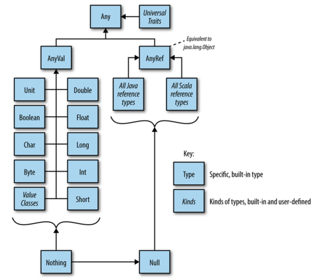

# Getting Started

## What's Scala

`Scala`是基于`JVM`之上的一门混合`OO`和`FP`的程序设计语言，由`Martin Odersky`创建。

***

## 建立Scala运行环境

### 安装JDK

创建`JDK`安装的目标目录：

```bash
$ mkdir -p /usr/java
```

解压至目标目录：

```bash
$ tar zxvf jdk-1.8.0_40.tar.gz -C /usr/java
$ ln -s /usr/java/jdk-1.8.0_40 /usr/java/default
```

将`bin`目录添加至`PATH`环境变量中：

```bash
$ vi ~/.bashrc
export JAVA_HOME=/usr/java/default
export PATH=$JAVA_HOME/bin:$PATH
```

验证环境：

```bash
$ java -version
```

```bash
java version "1.8.0_40"
Java(TM) SE Runtime Environment (build 1.8.0_40-b17)
Java HotSpot(TM) 64-Bit Server VM (build 25.65-b01, mixed mode)
```

### 安装Scala

创建`Scala`安装的目标目录：

```bash
$ mkdir -p /usr/scala
```

解压至目标目录：

```bash
$ tar zxvf scala-2.11.7.tar.gz -C /usr/scala
$ ln -s /usr/scala/scala-2.11.7 /usr/scala/default
```

将`bin`目录添加至`PATH`环境变量中：

```bash
$ vi ~/.bashrc
export SCALA_HOME=/usr/scala/default
export PATH=$SCALA_HOME/bin:$PATH
```

验证环境：

```bash
$ scala -version
```

```
Scala code runner version 2.11.7 -- Copyright 2002-2013, LAMP/EPFL
```

***

## Hello World

### Java实现

```java
public class Greetings {
  public static void main(String[] args) {
    System.out.println("hello, world!");
  }
}
```

### Scala

```scala
object Greetings {
  def main(args: Array[String]) {
    println("hello, world!")
  }
}
```

- `Scala`是一门纯的`OO`程序设计语言，在定义`main`函数时使用单键对象；
- 语句结束时分号是可选的；
- `args: Array[String]`定义变量时将类型放在后面；
- `Array[String]`类型参数使用`[String]`；
- `println`的使用更加直接简明，事实上`println`定义在`Predef`中

```scala
def println(x: Any) = Console.println(x)
```

### `App` trait

通过扩展`App`特质，便可以略去`main`函数，直接将`main`实现在单键对象`Greetings`中；其中`args`继承自`App`特质。

```scala
object Greetings extends App {
  println("hello, world!")
}
```

### Compile it

使用`scalac`编译`Scala`的应用程序，生成`JVM`一致的字节码。

```bash
$ scalac Greetings.scala
```

### Execute it

运行`Scala`程序，可以直接使用`scala`命令。

```bash
$ scala Greetings
```

### Script it

`Scala`虽然是一门静态编译时语言，但经过细致的加工，已经支持脚本的运行环境了。

```scala
println("hello, world!")
```

```bash
$ scala Greetings.scala
```

***

## Print Args

### `var`： Imperative Style

```scala
object Args extends App {
  var i = 0
  while (i < args.length) {
    println(args(i));
	  i += 1
  }
}
```

### `for` Comprehension

```scala
object Args extends App {
  for (arg <- args) {
    println(arg)
  }
}
```

### Function Literal

```scala
object Args extends App {
  args.foreach((arg: String) => println(arg))
}
```

### Type Inference

```scala
object Args extends App {
  args.foreach(arg => println(arg))
}
```

### Placeholder

```scala
object Args extends App {
  args.foreach(println _)
}
```

### Partially Applied Function

```scala
object Args extends App {
  args.foreach(println)
}
```

### Optional Comma and Parenthesis

```scala
object Args extends App {
  args foreach println
}
```

### Scala Script

```scala
#! /usr/bin/scala
args foreach println
```

***

## What is Scala?

### Pure Object-Oriented

在`Scala`中，`Everything is an Object`，它不区分`Primitive Types`和`Reference Types`。

```scala
1 to 10
1.toString
```

### Static Type

在`Java7`之前

```java
Map<String, List<String>> phonebook = new HashMap<String, List<String>>();
```

使用`Guava`的集合工具类

```java
Map<String, List<String>> phonebook = Maps.newHashMap();
```

`Java7`引入了部分类型推演的能力

```java
Map<String, List<String>> phonebook = new HashMap<>();
```

`Scala`具备强大的类型推演能力，简洁的语法可与动态语言相媲美。

```scala
improt java.util.{HashMap, List}

val phonebook = new HashMap[String, List[String]]();
```

### Expressive & Light-Weight

```scala
val phonebook = Map(
  "Horance" -> "+9519728872"
  "Dave"    -> "+9599820012"
)

println(phonebook("Dave"))
```

`->`不是`Scala`语言内置的操作符，而仅仅是通过类库的方式实现，不仅仅增强了表达力，而且充分说明`Scala`具有良好的可扩展性。

### High Level Abstraction

```java
public static boolean hasUpperCase(String name) {
  for (int i=0; i<name.length(); i++) {
    if (Character.isUpperCase(name.charAt(i))) {
      return true;
    }
  }
  return false;
}
```

相对于上述命令式(Imperative)的风格，`Scala`可以做得更加简洁，漂亮，并富有表达力。

```scala
val hasUpperCase = name.exists(_.isUpperCase)
```

需要注意的是，`exists`并非`java.lang.String`的方法，`Scala`拥有一套完备的机制增强既有类库的能力。

### Concise

```java
public class Person {
  private final String name;
  private final int age;

  public Person(String name, int age) {
    this.name = name;
	this.age = age;
  }

  public String name() {
    return name;
  }

  public int age() {
    return age;
  }

  @Override
  public int hashCode() {
    return 17 * name.hashCode() + age;
  }

  @Override
  public boolean equals(Object obj) {
    if (obj instanceof Person) {
      Person other = (Person)obj;
	  return name.equals(other.name) && age == other.age;
	}
	return false;
  }
}
```

而`Scala`只用一行代码即可，大幅度地减少代码量。

```scala
case class Person(val name: String, val age: Int)
```

### Extensible

`Scala`具有高度的可扩展性。`Scala`在没有改变语言内核和基本特性的前提下，通过扩展类库，便支持了并发编程的模式。

```scala
val service = actor {
  loop {
    receive {
	  case Add(x, y) => reply(x + y)
	  case Sub(x, y) => reply(x - y)
	}
  }
}

service ! Add(2, 3)
```

### DSL

这是使用`ScalaTest`框架设计的测试用例，表达力甚至超越了`RSpec`。你敢相信一门静态语言，也能设计出如此简洁的`DSL`？

```scala
class StackSpec extends FlatSpec {

  "A Stack" should "pop values in last-in-first-out order" in {
    val stack = new Stack[Int]
    stack.push(1).push(2)

    stack.pop() should be (2)
    stack.pop() should be (1)
  }

  private def emptyStack = new Stack[Int]

  "A Stack (when empty)" should "be empty" in {
    emptyStack shouldBe empty
  }

  it should "complain on peek" in {
    intercept[IllegalArgumentException] {
      emptyStack.peek
    }
  }
}
```

***

# Object-Oriented Programming

## 构造器

### 主构造器与构造参数

```scala
class Person(val firstName: String, val lastName: String)
```

### 辅构造器

```scala
class Person(val firstName: String, val lastName: String) {
  val age: Int = _

  def this(firstName: String, lastName: String, age: Int) = {
    this(firstName, lastName)
    this.age = age
  }
}
```

- 只有主构造器才能初始化父类；
- 只有主构造函数才能持有构造器参数；
- 辅构造函数的第一行可执行代码要么调用主构造函数，要么调用其它辅构造函数；

### 构造器私有化

```scala
class Person private(val firstName: String, val lastName: String)

object Person {
  def apply(firstName: String, lastName: String) = new Person(firstName, lastName)
}
```

```scala
val person = Person("horance", "liu")
```

***

## 方法调用

### `:`结尾的方法

```scala
1 :: 2 :: 3 :: Nil
Nil.::(3).::(2).::(1)
```

```scala
List(1, 2) ::: List(3)
List(3).:::(List(1, 2))
```

### 可选的`.`

为了提高表达力，`obj.do(parameter)`中的`.`常常被省略掉：`obj do parameter`，此时称为中缀表达式。

```scala
0 to arr.length - 1
0.to(arr.length - 1)

0 until arr.length
0.until(arr.length)

0 until (arr.length, 2)
0.until(arr.length, 2)
```

### 无参函数

按照社区惯例，如果没有副作用，则不使用括号；如果存在副作用，则使用括号，加以提示。

```scala
List(1, 2, 3).size     // OK
List(1, 2, 3).size()   // ERROR
```

对于无参数的函数调用，并括号可以省略的，常常被称为后缀表达式。

```scala
import scala.language.postfixOps

1 toString
List(1, 2, 3) size
```

### 具名参数

```scala
trait ProductSpec {
  def satisfy(p: Product): Boolean
}

sealed class CombinableSpec(shortcut: Boolean, specs: ProductSpec*) extends ProductSpec {
  override def satisfy(p: Product): Boolean = {
    specs.exists(_.satisfy(p) == shortcut)
  }
} 

case class AndSpec(preds: ProductSpec*) extends CombinableSpec(shortcut = false, preds: _*)
case class OrSpec(preds: ProductSpec*) extends CombinableSpec(shortcut = true,  preds: _*)
```

### `by name`参数

`by name`参数具有如下几个特点：

- 延迟计算
- 行为类似于无参函数

#### `loop`模拟

```scala
@annotation.tailrec
def loop(cond: => Boolean)(body: => Unit) {
  if (cond) {
    body
	  loop(cond)(body)
  }
}
```

```scala
var i = 0
loop (i < 10) {
  println(i)
  i += 1
}
```

***

## 伴生对象

```scala
package scala

final class Array[T](size: Int) {
  def length: Int
  def apply(i: Int): T
  def update(i: Int, x: T)
}

object Array {
  def apply[T](xs: T*): Array[T]
}
```

***

## `apply` and `update`

```scala
val numbers = Array(1, 2, 3)           // val numbers = Array.apply(1, 2, 3)
numbers(1)                             // numbers.apply(1)
numbers(1) = 100                       // numbers.update(1, 100)
```

注意区分如下两个语句的不同：

```scala
Array(3)      // res0: Array[Int] = Array(3)
new Array(3)  // res1: Array[Nothing] = Array(null, null, null)
```

***

## Case Class

`Case Class`是一种特殊的类，常常用于模式匹配。

```scala
case class Dollar(amount: Int)
```

- 字段自动成为`val`，除非显式地提供了`var`定义
- 自动生成`toString, equals, hashCode, copy`方法
- 自动地生成伴生对象的`apply/unapply`方法

```scala
class Dollar(val amount: Int) {
  def toString: String = ...
  def equals(other: Any): Boolean = ...
  def hashCode(): Int = ...
}

object Dollar {
  def apply(amount: Int) = new Dollar(amount)
  def unapply(d: Dollar): Option[Int] = Some(d.amount)
}
```

## 特质

### Rich Interface

```scala
trait RichIterable[A] {
  def iterator: Iterator[A]

  def foreach(f: A => Unit) = {
    val iter = iterator
	  while (iter.hasNext) f(iter.next)
  }

  def foldLeft[B](seed: B)(f: (B, A) => B) = {
    var result = seed
	  foreach(e => result = f(result, e))
	  result
  }
}
```

### Stacked Modification

#### `IgnoreCaseSet`

```scala
trait IgnoreCaseSet extends java.util.Set[String] {
  abstract override def add(e: String) = {
    super.add(e.toLowerCase)
  }

  abstract override def contains(e: String) = {
    super.contains(e.toLowerCase)
  }

  abstract override def remove(e: String) = {
    super.remove(e.toLowerCase)
  }
}
```

```scala
val set = new java.util.HashSet[String] with IgnoreCaseSet

set.add("HORANCE")
set.contains("horance")  // TRUE
```

#### `LoggableSet`

```scala
trait LoggableSet extends java.util.Set[String] {
  abstract override def add(e: String) = {
    println("Add: " + e)
	  super.add(e)
  }

  abstract override def remove(e: String) = {
    println("Remove: " + e)
	  super.remove(e)
  }
}
```

#### Order is Important

```scala
val set = new java.util.HashSet[String]
          with LoggableSet
		      with IgnoreCaseSet

set.add("HORANCE")  // Add: horance
```

```scala
val set = new java.util.HashSet[String]
          with IgnoreCaseSet
		      with LoggableSet

set.add("HORANCE")  // Add: HORANCE
```

### Composition

```scala
val order = new Order(customer)
   with Entity
   with InventoryItemSet
   with Invoicable
   with PurchaseLimiter
   with MailNotifier
   with ACL
   with Versioned
   with Transactional
```

***

## 类层次结构



### Referenc Types

- `AnyRef`的子类
- 使用`new`构造对象
- 当存在默认构造函数，可以略去括号
- `AnyRef`等价于`java.lang.Object`
- 可以将`null`赋值给`Reference Type`

***

### Value Types

- `AnyVal`的子类
- `Char, Byte, Short, Int, Long, Float, Double, Unit, Boolean`
- 不能使用`new`构造实例，而使用`Literal Values`构造实例
- 编译器将其映射为`Java`原生类型，以便提升性能
- 不能将`null`赋值给`Int`的变量

```scala
final abstract class Int private extends AnyVal {
  ...
}
```

- `final`表示不能被子类化
- `abstract`表示不能被实例化
- `private`表示主构造函数私有化，进一步保证不能被实例化
- `extends AnyVal`表示只能使用字面值构造实例

***

## Literal Values

### `Unit` and `()`

`Unit`类型在`JVM`中对应于`Java`的`void`。

```scala
final abstract class Unit private extends AnyVal {
}
```

`()`是其唯一的实例。

### Procedure

具有返回值类型为`Unit`的函数常常被称为**过程(Procedure)**。

```scala
def update(i: Int, value: Char): Unit = {
  ...
}
```

常常忽略`=`，`Scala`默认推演为`Unit`，上例等价于

```scala
def update(i: Int, value: Char) {
  ...
}
```

### `Null` and `null`

`Null`是所有`AnyRef`的子类型，存在唯一的实例`null`。不能将`null`赋予`Value Types`。

```scala
val num: Int = null  // Error
```

### Symbol Literals

```scala
'1th
'2th
```

如果符号中有空格，可以是使用`Symbol::apply`直接构造

```scala
Symbol("Programming Scala")
```

### Tuple Literal

`(1, "two")`等价于`Tuple2(1, "twp")`，或者`Tuple2[Int, String](1, "two")`。

```scala
val t1 = (1, "two")
val t1: (Int,String) = (1, "two")
val t2: Tuple2[Int,String] = (1, "two")
```

### Function Literals

`(i: Int, s: String) => s+i`是类型为`Function2[Int, String, String]`的一个字面值。

字面值的类型定义常常用于类型声明，如下三个变量定义是相同的：

```scala
val f1: (Int, String) => String = (i, s) => s + i
val f2 = (i: Int, s: String) => s + i
val f3: Function2[Int, String, String] = (i, s) => s+ i
```

### 自定义Literal

#### Map

```scala
val capital = Map("US" -> "Washington", "France" -> "Paris")
```

`"US" -> "Washington"`构造了一个类型为`Tuple2[String, String]`的二元组：`("US", "Washington")`。

```scala
package scala

object Predef {
  implicit final class ArrowAssoc[A](private val self: A) extends AnyVal {
    def ->[B](y: B) = (self, y)
  }
}
```

#### Regex

```scala
val regex = "([0-9]+) ([a-z]+)".r
```

#### String Interpolator

##### 标准的`s, f, raw`

```scala
package scala

case class StringContext(parts: String*) {
  def s(args: Any*): String = ???
  def f(args: Any*): String = ???
  def raw(args: Any*): String = ???
}
```

```scala
s"Hi, $name"
f"$name%s is ${height}%2.2f meters tail"
```
```scala
raw"a\nb"
"""a\nb"""
```

##### 自定义`String Interpolator`

```scala
implicit class JsonHelper(val sc: StringContext) extends AnyVal {
  def json(args: Any*): JSONObject = ???
}

val conf = json"{ a: $a }"
```

***

## Rich类型

```scala
1 to 10
1 until 10
```

`Int`隐式地转换为`RichInt`，从而使调用`to, until`的方法成为可能。其中，`Int`隐式转换为`RichInt`被定义在`Predef`对象中。

```scala
package scala

object Predef {
  implicit def intWrapper(x: Int) = new runtime.RichInt(x)
}
```

## Nothing

`Nothing`是任何类型的子类型，包括`Null`；特殊地，`Scala`推演`throw`语句的返回值类型为`Nothing`。

```scala
package scala

object Predef {
  def ??? = throw new NotImplementedError
}
```

`Nothing`是一个抽象类，在运行时不可能存在`Nothing`的实例，它仅仅为类型推演而存在。

***

## Nil

在`Predef`隐式地引入

```scala
package object scala {
  val Nil = scala.collection.immutable.Nil
}
```

等价于

```scala
List()  // List[Nothing]()
```

`Nil`可以通过`::`方法构造新的`List`

```scala
1 :: 2 :: Nil  // Nil.::(2).::(1), List(1, 2)
```

***

# Implicit Conversion

## Class Extension

```scala
"+9519760513".exists(_.isDigit)
```

`java.lang.String`并存在`exists`方法，为此标准库中在`Predef`定义了一个隐式转换，使`String`隐式地转换为`StringOps`，从而提供更多地操作字符串的方法。

```scala
object Predef {
  implicit def augmentString(x: String): StringOps = new StringOps(x)
}
```

## Implicit Resolution Rules

### Marking Rule

> Only definitions marked implicit are available.

```scala
object Predef {
  implicit def intWrapper(x: Int) = new scala.runtime.RichInt(x)
}
```

```scala
object Predef {
  implicit final class any2stringadd[A](private val self: A) extends AnyVal {
    def +(other: String): String = String.valueOf(self) + other
  }
}
```

### Scope Rule

> An inserted implicit conversion must be in scope as a **single identifier**, or be associated with the source or target type of the conversion.

```scala
case class Yard(val amount: Int)
case class Mile(val amount: Int)
```

`mile2yard`可以定义在`object Mile`

```scala
object Mile {
  implicit def mile2yard(mile: Mile) = new Yard(10*mile.amount)
}
```

也可以定义在`object Yard`中

```scala
object Yard {
  implicit def mile2yard(mile: Mile) = new Yard(10*mile.amount)
}
```

转换为目标类型时，常常发生如下两个场景：

- 传递参数时，但类型匹配失败；

```scala
def accept(yard: Yard) = println(yard.amount + " yards")
accept(Mile(10))
```

- 赋值表达式，但类型匹配失败

```scala
val yard: Yard = Mile(10)
```

### Other Rules

- **One-at-a-time Rule**: Only one implicit is tried.
- **Explicits-First Rule**: Whenever code type checks as it is written, no implicits are attempted.
- **No-Ambiguty Rule**: An implicit conversion is only inserted if there is no other possible conversion is inserted.

## Where implicits are tried?

- Conversions to an expected type
  - 传递参数时，但类型匹配失败；
  - 赋值表达式，但类型匹配失败

- Conversions of the receiver of a selection
  - 调用方法，方法不存在
  - 调用方法，方法存在，但参数类型匹配失败

- Implicit parameters

## Implicit parameters

```scala
import scala.math.Ordering

case class Pair[T](first: T, second: T){
  def smaller(implicit order: Ordering[T]) =
    order.min(first, second)
}
```

### 当`T`为`Int`

```scala
Pair(1, 2).smaller
```

编译器实际调用：

```scala
Pair(1, 2).smaller(Ordering.Int)
```

其中`Ordering.Int`定义在`Ordering`的伴生对象中

```scala
object Ordering {
  trait IntOrdering extends Ordering[Int] {
    def compare(x: Int, y: Int) =
      if (x < y) -1
      else if (x == y) 0
      else 1
  }
  implicit object Int extends IntOrdering
}
```

也就是说

```scala
implicitly[Ordering[Int]] == Ordering.Int  // true
```

其中，`implicitly`为定义在`Predef`的一个工具函数，用于提取隐式值

```scala
@inline def implicitly[T](implicit e: T) = e
```

### 当`T`为自定义类型

```scala
import scala.math.Ordering

case class Point(x: Int, y: Int)

object Point {
  implicit object OrderingPoint extends Ordering[Point] {
    def compare(lhs: Point, rhs: Point): Int =
	  (lhs.x + lhs.y) - (rhs.x + rhs.y)
  }
}
```

```scala
Pair(Point(0, 0), Point(1, 1)).smaller
```

等价于

```scala
Pair(Point(0, 0), Point(1, 1)).smaller(Point.OrderingPoint)
```

也就是说

```scala
implicitly[Ordering[Point]] == Point.OrderingPoint
```

## Context Bound

```scala
import scala.math.Ordering

case class Pair[T : Ordering](first: T, second: T) {
  def smaller(implicit order: Ordering[T]) = order.min(first, second)
}
```

可以使用`implicitly`简化

```scala
import scala.math.Ordering
case class Pair[T : Ordering](first: T, second: T) {
  def smaller = implicitly[Ordering[T]].min(first, second)
}
```

可以进一步简化

```scala
import scala.math.Ordering

case class Pair[T : Ordering](first: T, second: T) {
  def smaller = Ordering[T].min(first, second)
}
```

`Ordering[T]`首先调用了`object Ordering`的`apply`方法，从而便捷地找到了`Order[T]`的隐式值

```scala
object Ordering {
  def apply[T](implicit ord: Ordering[T]) = ord
}
```

所以`Ordering[T].min`等价于`implicitly[Ordering[T]].min`

## View Bound

```scala
import scala.math.Ordered

case class Pair[T](first: T, second: T){
  def smaller(implicit order: T => Ordered[T]) = {
    if (order(first) < second) first else second
  }
}
```

`implicit order: T => Ordered[T]`在`smaller`的局部作用域内，即是一个**隐式参数**，又是一个**隐式转换函数**。

```scala
import scala.math.Ordered

case class Pair[T](first: T, second: T){
  def smaller(implicit order: T => Ordered[T]) = {
    if (first < second) first else second
  }
}
```

又因为在`Predef`预定义了从`Int`到`RichInt`的隐式转换，而`RichInt`是`Ordered[Int]`的子类型，所以在`Predef`定义的`implicit Int => RichInt`的隐式转换函数可作为隐式参数`implicit order: T => Ordered[T]`的隐式值。

```scala
Pair(1, 2).smaller
```

等价于

```scala
Pair(1, 2).smaller(Predef.intWrapper _)
```

上述简化的设计，使得隐式参数`order`没有必要存在，这样的模式较为常见，可归一为一般模式：**View Bound**

```scala
import scala.math.Ordered

case class Pair[T <% Ordered[T]](first: T, second: T) {
  def smaller = if (first < second) first else second
}
```

需要注意的是：`T <% Ordered[T]`表示：`T`可以隐式转换为`Ordered[T]`；而`T <: Ordered[T]`表示：`T`是`Ordered[T]`的一个子类型。

## Upper Bound

```scala
import scala.math.Ordered

case class Pair[T <: Comparable[T]](first: T, second: T) {
  def smaller = if (first.compareTo(second) < 0) first else second
}
```

```scala
Pair("1", "2").smaller  // OK, String is subtype of Comparable[String]
Pair(1, 2).smaller      // Compile Error, Int is not subtype of Comparable[Int]
```

## DRY List

`Nil`对象定义在`scala.collection.immutable.List`中。

```scala
package scala.collection.immutable

sealed abstract class List[+A] {
  def isEmpty: Boolean
  def head: A
  def tail: List[A]
  
  def ::[B >: A] (x: B): List[B] =
    new scala.collection.immutable.::(x, this)

  def :::[B >: A](prefix: List[B]): List[B] =
    if (isEmpty) prefix
    else if (prefix.isEmpty) this
    else (new ListBuffer[B] ++= prefix).prependToList(this)
}

final case class ::[B](private var hd: B, private var tl: List[B]) extends List[B] {
  override def head : B = hd
  override def tail : List[B] = tl
  override def isEmpty: Boolean = false
}

case object Nil extends List[Nothing] {
  override def isEmpty = true
  override def head: Nothing = throw new NoSuchElementException("empty list")
  override def tail: List[Nothing] = throw new UnsupportedOperationException("empty list")
}
```

`Nil`可以通过`::`方法追加新的元素，并返回新的`List`。

```scala
1 :: 2 :: Nil  // Nil.::(2).::(1), List(1, 2)
```

`List`可以通过`:::`连接两个`List`，并返回新的`List`。

```scala
List(1, 2) ::: Nil  // Nil.:::(List(1, 2))
```


