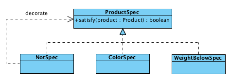

# Write Lean Programs

> OO makes code understandable by encapsulating moving parting, but FP makes code understandable by minimizing moving parts. －Michael Feathers

**刘光聪**，程序员，敏捷教练，开源软件爱好者，具有多年大型遗留系统的重构经验，对`OO`，`FP`，`DSL`等领域具有浓厚的兴趣。

- GitHub: [https://github.com/horance-liu](https://github.com/horance-liu)
- Email: [horance@outlook.com](horance@outlook.com)

## Product Repository


### First Attempt: The Worst Implement

***需求1***：在仓库中查找所有颜色为**红色**的产品

```java
public ArrayList findAllRedProducts(ArrayList repo) {
  ArrayList result = new ArrayList();
  for (int i=0; i<repo.size(); i++) {
    Product product = (Product)repo[i];
    if (product.getColor() == Color.RED) {
	   result.add(product);
    }
  }
  return result;
}
```

- 指令式(Imperative)
- 缺乏编译时类型安全性检查
- 实现类型
- 硬编码
- 重复设计

### Second Attempt: Using `for-each`

```java
public List<Product> findAllRedProducts(List<Product> repo) {
  List<Product> result = new ArrayList<>();
  for (Product p : repo) {
    if (p.getColor() == Color.RED) {
	  result.add(p);
    }
  }
  return result;
}
```

### Third Attempt: Parameterizing

***需求2***：在仓库中查找所有颜色为**绿色**的产品

`Copy-Paste`是大部分程序员最容易犯的毛病，为此引入了大量的重复代码。

```java
public List<Product> findAllGreenProducts(List<Product> repo) {
  List<Product> result = new ArrayList<>();
  for (Product p : repo) {
    if (p.getColor() == Color.GREEN) {
	  result.add(p);
    }
  }
  return result;
}
```

为了消灭`Hard Code`和重复代码，得到可重用的代码，可以引入简单的**参数化**设计。

```java
public List<Product> findProductsByColor(List<Product> repo, Color color) {
  List<Product> result = new ArrayList<>();
  for (Product p : repo) {
    if (p.getColor() == color) {
	  result.add(p);
    }
  }
  return result;
}
```

### Forth Attempt: Parameterizing with Every Attribute You Can Think Of

***需求3***：查找所有**重量小于10**的所有产品

大部分程序员依然会使用`Copy-Paste`解决这个问题，拒绝`Copy-Paste`的陋习，最具实效的一个办法就是把`Copy-Paste`的快捷键失效，当每次尝试`Copy-Paste`时提醒自己做更好的设计。

```java
public List<Product> findProductsBelowWeight(List<Product> repo, int weight) {
  List<Product> result = new ArrayList<>();
  for (Product p : repo) {
    if (p.getWeight() < weight) {
	  result.add(p);
    }
  }
  return result;
}
```

为了消除两者重复的代码，通过简单的**参数化**往往不能完美解决这类问题，相反会引入额外的复杂度。

```java
public List<Product> findProducts(List<Product> repo, Color color, int weight, boolean flag) {
  List<Product> result = new ArrayList<>();
  for (Product p : repo) {
    if ((flag && p.getColor() == color) ||
	   (!flag && p.getWeight() < weight)) {
	  result.add(p);
    }
  }
  return result;
}
```

日常工作中这样的实现手法非常普遍，函数的参数列表随着需求增加不断增加，函数逻辑承担的职责越来越多，逻辑也变得越来越难以控制。

### Firth Attempt: Abstracting over Criteria

为此需要抽取出隐藏的概念，使其遍历的算法与查找的标准能够独立地变化，将**行为参数化**。

```java
public interface ProductSpec {
  boolean satisfy(Product product);
}
```

此刻`findProducts`的算法逻辑得到封闭。

```java
public List<Product> findProducts(List<Product> repo, ProductSpec spec) {
  List<Product> result = new ArrayList<>();
  for (Product p : repo) {
    if (spec.satisfy(p)) {
	  result.add(p);
    }
  }
  return result;
}
```

通过可复用的`Functor`来封装各种变化，让变化的因素控制在最小的范围内。

```java
public class ColorSpec implements ProductSpec {
  private Color color;

  public ColorSpec(Color color) {
    this.color = color;
  }

  @Override
  public boolean satisfy(Product product) {
    return product.getColor() == color;
  }
}
```

```java
public class BelowWeightSpec implements ProductSpec {
  private int limit;

  public BelowWeightSpec(int limit) {
    this.limit = limit;
  }

  @Override
  public boolean satisfy(Product product) {
    return product.getWeight() < limit;
  }
}
```

用户的接口也变得简单多了，而且富有表现力。

```java
List<Product> products = findProducts(repo, new ColorSpec(RED));
```


这是经典的`OO`设计，如果熟悉设计模式的读者对此已经习以为常了。设计模式是好东西，但常常被人依葫芦画瓢，死板照抄，甚至被滥用。事实上，引入或去除设计模式是一个很**自然**的过程。与大师们交流，问究此处为何引入设计模式，得到的答案：直觉。忘记所有设计模式吧，管它是不是模式，如果设计是简单的，它这就是模式。

至此，代码另外还有一个明显的坏味道，`ColorSpec`和`BelowWeightSpec`都需要继承`ProductSpec`，都需要定义一个构造函数和一个私有的字段，并重写`satisfy`方法，这是一种典型的重复现象：**重复型结构**。

因`Java`缺乏闭包的支持，程序员不得不承受这样的烦恼，但此刻暂时不关心，继续前进。

### Sixth Attempt: Composite Criteria

***需求4***：查找所有**颜色为红色或者绿色**，并且**重量小于10**的产品

按照既有的代码结构，往往易于设计出类似`ColorAndBelowWeightSpec`的实现。

```java
public class ColorAndBelowWeightSpec implements ProductSpec {
  private Color color1;
  private Color color2;
  private int limit;

  public ColorAndBelowWeightSpec(Color color1, Color color2， int limit) {
    this.color1 = color1;
    this.color2 = color2;
    this.limit = limit;
  }

  @Override
  public boolean satisfy(Product p) {
    return (p.getColor() == color1 || p.getColor() == color2) 
        && (p.getWeight() < limit);
  }
}
```

存在两个明显的坏味道：

- 类名中包含`And`往往是违背单一职责的信号灯
- `ColorAndBelowWeightSpec`的实现与`ColorSpec`，`BelowWeightSpec`之间存在明显的重复

此刻，需要寻找更本质的抽象来表达设计，引入`and/or`的语义模型。

- Composite Spec: AndSpec, OrSpec
- Atomic Spec：ColorSpec, BeblowWeightSpec


```java
publc class AndSpec implements ProductSpec {
  private List<ProductSpec> specs = new ArrayList<>();

  public AndSpec(ProductSpec... specs) {
    this.specs.addAll(Arrays.asList(specs));
  }

  @Override
  public boolean satisfy(Product p) {
    for (ProductSpec spec : specs) {
	  if (!spec.satisfy(p))
	    return false;
	}
	return true;
  }
}
```

```java
publc class OrSpec implements ProductSpec {
  private List<ProductSpec> specs = new ArrayList<>();

  public OrSpec(ProductSpec... specs) {
    this.specs.addAll(Arrays.asList(specs));
  }

  @Override
  public boolean satisfy(Product p) {
    for (ProductSpec spec : specs) {
	  if (spec.satisfy(p))
	    return true;
	}
	return false;
  }
}
```

可以通过`AndSpec`组合`ColorSpec, BelowWeightSpec`来实现需求，简单漂亮，并且富有表达力。

```java
List<Product> products = findProducts(repo, new AndSpec(
  new OrSpec(new ColorSpec(RED), new ColorSpec(Greeen)), new BelowWeightSpec(10));
```

此时设计存在两个严重的坏味道：

- `AndSpec`与`OrSpec`存在明显的代码重复
- 大堆的`new`让人眼花缭乱


### Seventh Attempt: Extract Parent

先尝试消除`AndSpec`与`OrSpec`存在的代码重复，`OO`设计的第一个直觉就是通过抽取基类。

```java
class CombinableSpec implements ProductSpec {
  private List<ProductSpec> specs = new ArrayList<>();
  private boolean shortcut;

  protected CombinableSpec(List<ProductSpec> specs, boolean shortcut) {
    this.specs.addAll(specs);
	this.shortcut = shortcut;
  }

  @Override
  public boolean satisfy(Product p) {
    for (ProductSpec spec : specs) {
	  if (spec.satisfy(p) == shortcut)
	    return shortcut;
	}
	return !shortcut;
  }
}
```

通过**参数化**配置，复用`CombinableSpec`的实现。

```java
publc class AndSpec extends CombinableSpec {
  public AndSpec(ProductSpec... specs) {
    super(Arrays.asList(specs), false);
  }
}
```

```java
publc class OrSpec extends CombinableSpec {
  public OrSpec(ProductSpec... specs) {
    super(Arrays.asList(specs), true);
  }
}
```

如何评判`boolean`接口的使用呢？在不损伤可理解性的前提下，为了消除重复的设计是值得推荐的。`boolean`接口的可理解性关键依赖于调用点与函数接口之间的距离，如果在同一个文件，同一个类，并能在一个页面显示的，是完全可以接受的。

### Eighth Attempt: Decorate Criteria

***需求5***：查找所有**颜色为不是红色**的产品

```java
publc class NotSpec implements ProductSpec {
  private ProductSpec spec;

  public NotSpec(ProductSpec spec) {
    this.spec = spec;
  }

  @Override
  public boolean satisfy(Product p) {
    return !spec.satisfy(p);
  }
}
```

`NotSpec`是一种修饰了的`ProductSpec`，同时也使得用户的接口也变得更加人性化了。

```java
List<Product> products = findProducts(repo, new NotSpec(new ColorSpec(RED)));
```




### Ninth Attempt: Using Static Factory to DSL

之前遗留了一个问题，一大堆眼花缭乱的`new`使得代码失去了部分的可读性。

```java
List<Product> products = findProducts(repo, new AndSpec(
  new OrSpec(new ColorSpec(RED), new ColorSpec(Greeen)), new BelowWeightSpec(10));
```

可以引入`DSL`改善程序的可读性，让代码更具表达力。

```java
List<Product> products = findProducts(repo, and(or(color(RED), color(GREEN)), belowWeight(10)));
```

上述的DSL可以使用`static factory`的设计手段简单实现。按照惯例，可以建立类似于`ProductSpecs`的工具类，将这些工厂方法搬迁到工具类中去。

接口与对应工具类的对称性设计在`Java`社区中应用非常广泛，例如标准库中的`java.util.Collection/java.util.Collections`的设计。

```java
public interface ProductSpec {
  boolean satisfy(Product p);
}
```

```java
public final class ProductSpecs {
  public static ProductSpec color(final Color color) {
    return new ProductSpec() {
      @Override
      public boolean satisfy(Product p) {
        return p.getColor() == color;
      }
    };
  }

  public static ProductSpec belowWeight(final int limit) {
    return new ProductSpec() {
      @Override
      public boolean satisfy(Product p) {
        return p.getWeight() < limit;
      }
    };
  }

  public static ProductSpec and(ProductSpec... specs) {
    return new CombinableSpec(Arrays.asList(specs), false);
  }

  public static ProductSpec or(ProductSpec... specs) {
    return new CombinableSpec(Arrays.asList(specs), true);
  }

  public static ProductSpec not(final ProductSpec spec) {
    return new ProductSpec() {
      @Override
      public boolean satisfy(Product p) {
        return !spec.satisfy(p);
      }
    };
  }

  private ProductSpecs() {
    throw new AssertionError("no instances");
  }
}
```

此外，使用匿名内部类，可以得到意外的惊喜。通过有限地引入闭包的概念，从而避免了类似**Firth Attempt/Sixth Attempt**的设计中引入多余的构造函数和成员变量的复杂度，从而消除了部分的**结构性重复**的坏味道。

当然，要让这些`static factory`可见，需要`import static`导入这些方法。

```java
import static practical.programming.overview.ProductSpec.*;

List<Product> products = findProducts(repo, not(and(color(RED), belowWeight(10)));
```

### Tenth Attempt: Moving Static Factory into Interface

使用`Java8`可以将这些工厂方法直接搬迁到`ProductSpec`的接口中去，这样做至少得到两个好处。

- 可以删除`ProductSpecs`的工具类
- 使的接口和静态方法(尤其静态工厂方法)关系更加紧密

`Java8`并没有因为`comparing`等静态工厂方法的增强而建立`Comparators`的工具类，而是直接将它们集成在`Comparator`的接口中，这是自`Java8`之后思维的一个新的转变（`Comparator.comparing`的实现留作作业巩固今天所学知识）。

对于本例，可以将`ProductSpecs`删除，将所有静态工厂方法搬迁到`ProductSpec`中去。

```java
public interface ProductSpec {
  boolean satisfy(Product p);

  static ProductSpec color(Color color) {
    return new ProductSpec() {
	  @Override
      public boolean satisfy(Product p) {
        return p.getColor() == color;
      }
    };
  }

  static ProductSpec belowWeight(int limit) {
    return new ProductSpec() {
	  @Override
      public boolean satisfy(Product p) {
        return p.getWeight() < limit;
      }
    };
  }

  static ProductSpec and(ProductSpec... specs) {
    return new CombinableSpec(Arrays.asList(specs), false);
  }

  static ProductSpec or(ProductSpec... specs) {
    return new CombinableSpec(Arrays.asList(specs), true);
  }

  static ProductSpec not(ProductSpec spec) {
    return new ProductSpec() {
	  @Override
      public boolean satisfy(Product p) {
        return !spec.satisfy(p);
      }
    };
  }
}
```

### Eleventh Attempt: Using Null Object

***需求6***：**无条件过滤掉**或**不过滤**查找所有产品

```java
import static practical.programming.overview.ProductSpec.*;

List<Product> products = findProducts(repo, always(false));
```

```java
public interface ProductSpec {
  boolean satisfy(Product p);

  static ProductSpec always(boolean bool) {
    return new ProductSpec() {
      @Override
      public boolean satisfy(Product p) {
        return bool;
      }
    };
  }
}
```

至此，`ProductSpec`存在如下一些类型：

- Composite Specs: and, or
- Decorator Specs: not
- Atomic Specs: always, color, beblowWeight

### Twelfth Attempt: Using Lambda Expression

`Java8`可以使用`Lambda`表达式改善设计，增强表达力。

```java
List<Product> products = findProducts(repo, (Product p) -> p.getColor() == RED);
```

通过类型推演，可以进一步省略`Labmda`表达式中参数的类型信息。

```java
List<Product> products = findProducts(repo, p -> p.getColor() == RED);
```

当然，你可以通过提取`static factory`，构造DSL复用这些`Lambda`表达式。

```java
@FunctionalInterface
public interface ProductSpec {
  boolean satisfy(Product p);

  static ProductSpec color(Color color) {
    return p -> p.getColor() == color;
  }

  static ProductSpec weightBelow(int limit) {
    return p -> p.getWeight() < limit;
  }
}
```

```java
List<Product> products = findProducts(repo, color(RED));
```

其中，`@FunctionalInterface`注解标注了`ProductSpec`是一个函数式接口，其抽象方法`boolean satisfy(Product p)`的原型描述了`lambda`表达式的`Function Descriptor`。

### Thirteenth Attempt: Chaining Speciafications

遗留了一个**问题**: 如何替换匿名内部类，使用`lambda`实现 `and/or/not/always`的语义?

```java
@FunctionalInterface
public interface ProductSpec {
  boolean satisfy(Product p);

  default ProductSpec negate() {
    return p -> !satisfy(p);
  }

  default ProductSpec and(ProductSpec other) {
    return (p) -> satisfy(p) && other.satisfy(p);
  }

  default ProductSpec or(ProductSpec other) {
    return (p) -> satisfy(p) || other.satisfy(p);
  }

  static ProductSpec always(boolean bool) {
    return p -> bool;
  }

  static ProductSpec color(Color color) {
    return p -> p.getColor() == color;
  }

  static ProductSpec belowWeight(int limit) {
    return p -> p.getWeight() < limit;
  }
}
```

这里引入了`Java8`一个重要的设计工具：`default method`，简单漂亮，并巧妙地实现`DSL`的设计，用户接口变得更加流畅、友好。

```java
List<Product> products = findProducts(repo, color(RED).and(belowWeight(10)));
```

`Java8`支持`default method`，扩展了`interface`原来的语义，从而隐式地支持了组合式设计，使的`OO`的设计更加完善和强大。

### Fourteenth attempt: Using Method Reference

***需求7***：查找所有**伪劣**的产品

```java
List<Product> products = findProducts(repo, p -> p.fake());
```

可以使用`Method Reference`进一步改善`lambda`的表达力。

```java
List<Product> products = findProducts(repo, Product::fake);
```

### Fifteenth attempt: Abstracting over Type

泛化类型信息，让算法更具有通用性，并进一步增强代码的可复用性。

```java
public static <T> List<T> filter(List<T> list, Predicate<T> p) {
  List<T> result = new ArrayList<>();
  for (T e : list) {
  if (p.test(e)) {
	  result.add(e);
	}
  }
  return result;
}
```

这样的实现存在一个明显的**问题**：泛型参数缺乏**型变**的能力。通过对泛型参数实施**无限定类型通配符**的修饰，从而使的算法实现更加具有弹性和通用性。

```java
public static <T> List<T> filter(List<? extends T> list, Predicate<? super T> p) {
  List<T> result = new ArrayList<>();
  for (T e : list) {
    if (p.test(e)) {
	  result.add(e);
	}
  }
  return result;
}
```

### Sixteenth: Maximize Reusability

`and, or, not, always`在代数系统中具有稳定的抽象，为此需要进一步重构，以便最大化代码的可复用性。这样当需要建立诸如`NumberSpec, FruitSpec`时无需重复地再写一遍`and, or, not, always`的实现。

为此，建立更为抽象的`Predicate`的概念，并将通用的、抽象的`negate, and, or, always`搬迁到`Predicate`中去，使其具有更大的可复用性。

```java
@FunctionalInterface
public interface Predicate<T> {
  boolean test(T t);

  default Predicate negate() {
    return p -> !satisfy(p);
  }

  default Predicate<T> and(Predicate<? super T> other) {
    return p -> satisfy(p) && other.satisfy(p);
  }

  default Predicate<T> or(Predicate<? super T> other) {
    return p -> satisfy(p) || other.satisfy(p);
  }
  
  static Predicate<T> always(boolean bool) {
    return p -> bool;
  }
}
```

同时，将领域内的`color, belowWeight`等原子放回`ProductSpecs`工具类中去(因为不存在`ProductSpec`的接口了)，让领域内的`lambda`表达式具有更大的复用性。

```java
public final class ProductSpecs {
  public static Predicate<Product> color(Color color) {
    return p -> p.getColor() == color;
  }

  public static Predicate<Product> belowWeight(int limit) {
    return p -> p.getWeight() < limit;
  }

  private ProductSpecs() {
    throw new AssertionError("no instances");
  }
} 
```

至此，可复用的基础设施便从领域中剥离出来，使其具有更高度的可重用性。

### Seventeenth Attempt: Using Stream API

`Java8`可以使用集合库的`Stream`复用代码。

```java
import static java.util.stream.Collectors.toList;

repo.stream()
    .filter(p -> p.getColor() == RED && p.getPrice() < 10)
    .collect(toList());
```

如果要支持并发，则可以构建`parallelStream`。

```java
import static java.util.stream.Collectors.toList;

repo.parallelStream()
    .filter(p -> p.getColor() == RED && p.getPrice() < 10)
    .collect(toList());
```

集合类通过`stream, parallelStream`工厂方法创建`Stream`之后，其操作可分为`2`种基本类型：

- Transformation：其返回值为`Stream`类型
- Action：其返回值不是`Stream`类型

通过`Stream`的机制，实现了集合类的惰性求值，直至`Action`才真正地开始执行计算。`Transformation`从某种意义上，可以看成是`Stream`的`Builder`，直至`Action`启动执行。

### Eighteenth attempt: Replace Java with Scala

`Scala`语言是一门跨越`OO`和`FP`的一个混血儿，可以方便地与`Java`进行互操作。在`Scala`中，函数作为一等公民，使用`Lambda`是一个很自然的过程。当你熟悉了`Scala`，我相信你绝对会放弃`Java`，放弃`Java8`，犹如作者本人一样。

```scala
repo.filter(p => p.color == RED && p.weight < 10)
```

遗留了三个**问题**: 

- 如何复用`lambda`表达式？
- 如何实现 `and/or/not`的语义？
- 如何实现 `always`的语义？

### Nineteenth Attempt: Abstracting Control Structure

引入**静态工厂方法**及其**操作符重载**的机制构造内部`DSL`。

```scala
import ProductSpec._

repo.filter(color(RED) && belowWeight(10))
```

```scala
object ProductSpec {
  def color(color: Color) = ???
  def bebowWeight(limit: Int) = ???
}
```

如何替换实现`???`，并让其具有`&&, ||, !`的语义呢？

```scala
object ProductSpec {
  def color(color: Color) = new Predicate((p: Product) => p.color == color)
  def bebowWeight(limit: Int) = new Predicate((p: Product) => p.weight < limit)
}
```

`Predicate`一个扩展匿名函数`A => Boolean`的子类，其中，从面向对象的角度看，`A => Boolean`的类型为`Function[A, Boolean]`。

```scala
class Predicate[A](pred: A => Boolean) extends (A => Boolean) {
  override def apply(a: A) = pred(a)

  def &&(that: A => Boolean) = new Predicate[A](x => pred(x) && that(x))
  def ||(that: A => Boolean) = new Predicate[A](x => pred(x) || that(x))
  def unary_! = new Predicate[A](x => !pred(x))
}
```

其中`!`是一个一元操作符。


### Twentieth Attempt: Using Companion Object 

`always`静态工厂方法，可以搬迁到`Predicate`的伴生对象中去。

```java
object Predicate {
  def always[A](bool: Boolean) = new Predicate[A](_ => bool)
}
```

`Predicate`的设计既使用了`OO`的特性，又引入了`FP`的思维，`Scala`使其两者如此和谐、完美，简直不可思议。

## Conclusion

世界是多样性的，计算机工业也不仅仅只存在一种方法论。在我的哲学观里，OO和FP之间并不矛盾，而是一个和谐的，相互补充的统一体。

除了C++语言之外，使得我最偏爱Scala，多范式，一个问题存在多种解决方案等等思维习惯，给了程序员最灵活、最自由的空间。

## Review `Comprator.comparing`

以标准库`Collections.sort`，及其`Comparator`在`Java8`中的增强，及其`Comparator.comparing`的泛型定义复习今天所学知识。

```java
public final class Collectins {
  private Collectins() {
  }
  
  public static <T> void sort(List<T> list, Comparator<? super T> c) {
    list.sort(c);
  }
} 
```

使用匿名内部类是`Collectins.sort`最经典的使用方法之一。

```java
Collections.sort(products, new Comparator() {
  @Override
  public int compare(Product p1, Product p2) {
    return p1.getName().compareTo(p2.getName);
  }
});
```

可以通过`lambda`表达式替代匿名内部类，简化设计。

```java
Collections.sort(products, (Product p1, Product p2) -> p1.getName().compareTo(p2.getName));
```

通过类型推演，但依然得到编译器类型安全的保护。

```java
Collections.sort(products, (p1, p2) -> p1.getName().compareTo(p2.getName));
```

通过`Comprator.compring`的静态工厂方法，改善表达力。

```java
Collections.sort(persons, comparing(p -> p.getName()))
```

通过`Function Reference`的机制，进一步改善表达力。

```java
Collections.sort(persons, comparing(Person::getName()))
```

其中，`Comprator.compring`的实现为:

```java
@FunctionalInterface
public interface Comparator<T> {
  int compare(T o1, T o2);

  static <T, U extends Comparable<? super U>> Comparator<T> 
    comparing(Function<? super T, ? extends U> extractor) {
      return (c1, c2) -> extractor.apply(c1).compareTo(extractor.apply(c2));
  }
}
```

